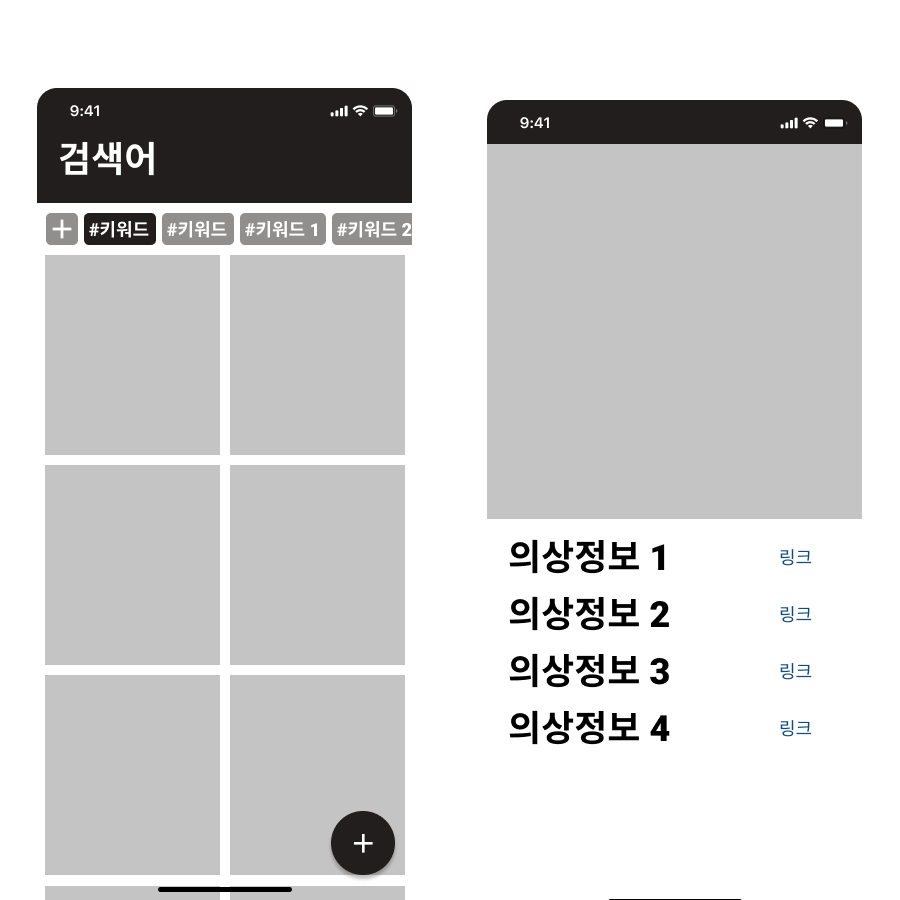
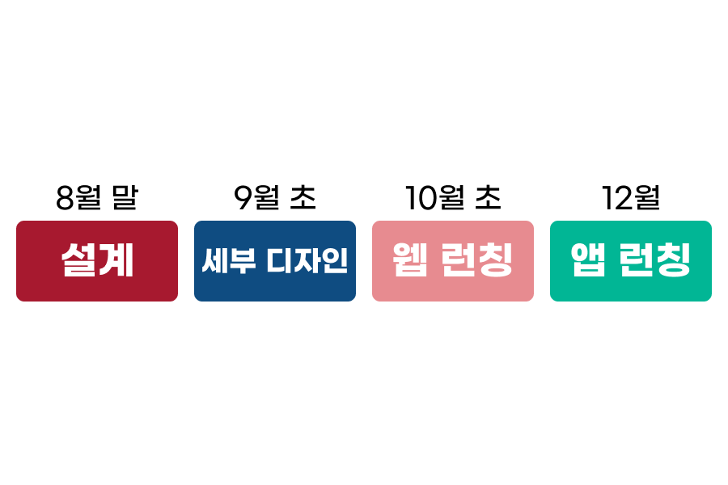

# Close at

> **연애인 착장 정보를 제공하는 사이트.**

### 🍒어떤 서비스 인가?

**Close at**은 셀럽이 **착용한 옷과 악세사리** 등에 대한 정보를 제공하는 사이트이다. 

### 👕Close at은 무슨 뜻인가?

**Close at**은 옷장을 뜻하는 **Closet**과 같은 발음을 갖는 문구로 옷이나 악세사리 등 패션아이템을 통해 셀럽에게 보다 가까워진다라는 상징적인 의미를 갖는다.

### 🍔시장에서 먹힐까?

**셀럽의 패션아이템**에 대한 정보는 이미 인스타그램 등 SNS에서 **제공자와 수요자**가 있는 상황이다(➡️ [인스타 에쉬아일랜드 패션 정보 계정](https://www.instagram.com/ash.island_closet/)). SNS에 존재하는 이 시장을 보다 가독성 높고 사용성 좋게 **웹 사이트**로 만들어 시장에 도전하려고 한다.

### 🧱유사한 서비스?

**룩핀**과 **온더룩**을 가장 유사한 서비스로 볼 수 있다. 하지만 두 서비스는 모두 일반인들이 자신의 코디정보를 공유하는 서비스로, **셀럽의 패션 아이템 정보는 찾아보기 어렵다.**

### 💵돈을 어떻게 벌 것인가?

1. 패션 브랜드와의 콜라보레이션. (➡️ 해당 옷에 대한 정보를 보다 쉽게 얻을 수 있다)
2. 특정 패션 스토어를 우선적으로 노출.
3. 사용자의 성별과 나이대 등 개인 정보에 기반한 패션 아이템 광고

### 😲대략적으로 어떻게 생겼는가?

### 📅언제 시작해서 언제 끝나는가?

### 💻어떤 기술로 만들어지는가?

- **React**
- **Spring boot**
- **AWS**

---

[We are **wouldyou.in**](https://www.instagram.com/wouldyouin.official/)